# 任务调度系统介绍

## 简介

任务调度系统目的是对spring boot类型的java项目的cron类型的定时任务进行集中管理，实现分布式的任务调度，任务自动发现，任务执行状态可视化查看等功能。

任务调度系统主要功能有：

1. 任务管理和查看。提供任务调度管理后台，可以可视化管理（增删改查任务配置）和查看任务执行情况
2. 失败转移。如果执行任务的节点在获取到任务后挂掉，调度系统会自动将任务发送到其他节点重新执行
3. 调度中心。拥有一个集中式的任务调度中心，并通过备份节点实现高可用，用来集中管理和调度任务
4. 指标监控。系统中对于关键系统指标和节点jvm相关指标都做了监控，并支持输出到InfluxDB中

任务调度系统包含三大子系统：Admin，Scheduler，Executor。其中Admin是后台管理系统，用来可视化配置任务，查看任务运行状态，执行日志信息等。Scheduler是调度器，用来根据执行节点的状态统一调度任务到执行节点执行，并可配置失败重试，执行超时停止等功能。Executor是执行器，集成在每一个执行节点上，用来接收来自调度器的任务，并调用应用程序的对应方法执行，在任务执行完毕后上报执行结果到调度器。Executor在应用程序启动时，会自动扫描应用程序声明的所有定时任务，并保存到ZooKeeper中，以便Admin系统可以在后台直接配置对应任务参数，从而实现了任务发现的功能。

## 系统设计

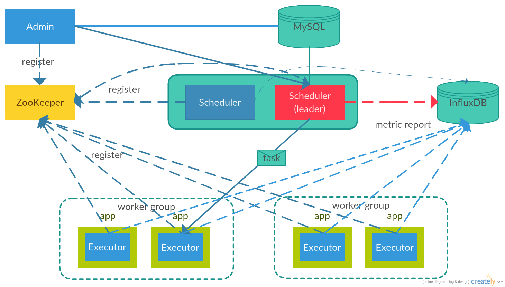

调度器三大子系统，Admin，Scheduler，Executor在启动时都需要到注册中心（当前为ZooKeeper实现）注册自身节点，从而实现节点发现功能。Admin通过注册中心获取当前所有的Scheduler节点，然后向所有的Scheduler发送请求，从而获取当前的leader Scheduler，之后在手动触发任务时，就可以直接向leader Scheduler发送请求。Scheduler通过注册中心获取到所有注册的Executor节点，在任务下发时，会根据任务所属的worker group，选择worker group中的一个Executor节点下发任务（**当前Executor区分了stage还是online，Scheduler只会向online的Executor下发任务，但是可以在Admin后台手动触发任务时，选择将任务提交到stage节点还是online节点**）。Executor通过注册中心注册自身节点，并将应用程序所包含的所有任务信息元数据保存到注册中心中，以便Admin，Scheduler获取。任务运行日志保存在MySQL中，可以通过Admin可视化查看任务运行情况。

## 依赖&环境

任务调度系统所有的依赖以及版本如下（由于使用者最终是在java项目中引入core包和executor包，所以core包和executor包的依赖会最终出现在java项目中）：

```gradle
slf4jVersion = '1.7.22'
guavaVersion = '20.0'
commonsLangVersion = '3.5'
jsr305Version = '3.0.1'
curatorVersion = '2.11.1'
springVersion = '4.3.4.RELEASE'
mockitoVersion = '2.5.5'
nettyVersion = '4.1.6.Final'
mybatisVersion = '3.4.2'
gsonVersion = "2.8.0"
mysqlVersion = "6.0.5"
springBootVersion = '1.5.1.RELEASE'
mybatisSpringBootStarterVersion = '1.2.0'
metricsVersion = '3.1.2'
metricsInfluxdbVersion = '0.9.3'

// core
compile group: 'org.apache.curator', name: 'curator-recipes', version: "$curatorVersion"
compile group: 'org.apache.curator', name: 'curator-test', version: "$curatorVersion"
compile group: 'org.apache.curator', name: 'curator-x-discovery', version: "$curatorVersion"
compile group: 'io.netty', name: 'netty-all', version: "$nettyVersion"
compile group: 'org.slf4j', name: 'slf4j-log4j12', version: "$slf4jVersion"
compile group: 'com.google.guava', name: 'guava', version: "$guavaVersion"
compile group: 'org.apache.commons', name: 'commons-lang3', version: "$commonsLangVersion"
compile group: 'com.google.code.findbugs', name: 'jsr305', version: "$jsr305Version"
compile group: 'com.google.code.gson', name: 'gson', version: "$gsonVersion"
compile group: 'io.dropwizard.metrics', name: 'metrics-core', version: "$metricsVersion"
compile group: 'io.dropwizard.metrics', name: 'metrics-jvm', version: "$metricsVersion"
compile group: 'io.dropwizard.metrics', name: 'metrics-graphite', version: "$metricsVersion"
compile group: 'com.github.davidb', name: 'metrics-influxdb', version: "$metricsInfluxdbVersion"
testCompile group: 'junit', name: 'junit', version: '4+'
testCompile group: 'org.mockito', name: 'mockito-core', version: "$mockitoVersion"

// scheduler
compile project(":core")
compile group: 'org.mybatis', name: 'mybatis', version: "$mybatisVersion"
runtime group: 'mysql', name: 'mysql-connector-java', version: "$mysqlVersion"
testCompile group: 'junit', name: 'junit', version: '4+'

// executor
compile group: 'org.springframework', name: 'spring-core', version: "$springVersion"
compile group: 'org.springframework', name: 'spring-context', version: "$springVersion"
compile group: 'org.springframework', name: 'spring-aspects', version: "$springVersion"
testCompile group: 'junit', name: 'junit', version: '4+'
testCompile group: 'org.springframework', name: 'spring-test', version:"$springVersion"
// admin
classpath("org.springframework.boot:spring-boot-gradle-plugin:$springBootVersion")
compile('org.springframework.boot:spring-boot-starter-freemarker')
compile("org.mybatis.spring.boot:mybatis-spring-boot-starter:$mybatisSpringBootStarterVersion")
compile('org.springframework.boot:spring-boot-starter-web')
runtime('mysql:mysql-connector-java')
providedRuntime('org.springframework.boot:spring-boot-starter-tomcat')
testCompile('org.springframework.boot:spring-boot-starter-test')
```

使用前提：由于任务调度系统使用了java 8 lamda表达式语法，所以目前只支持java 8及以上版本的项目使用。开发者开发的java项目需要为使用spring boot的项目（目前支持以jar包或war包形式部署的java项目），且web项目中的配置文件需要遵守任务调度系统的默认规则（具体使用方法见下文使用说明）。

## 使用说明

目前项目jar包还没有上传到maven中央仓库。首先需要将core和executor模块编译为jar包，然后将在java应用项目中直接导入这两个jar包即可。应用项目中的使用示例请见executor-example。而对于admin和scheduler，需要使用者在修改配置文件中的数据库配置和zookeeper配置后（配置方法见下文），编译打包并自行部署。

在真正部署项目前，需要在MySQL中执行core模块中script.sql文件中的sql来创建任务调度系统需要的数据表（数据表说明见下文）。

### scheduler配置&编译&启动

首先修改scheduler的配置文件database.properties和dts.properties，用来配置数据库和调度器scheduler的配置：

database.properties：

```
driver=com.mysql.jdbc.Driver
url=jdbc:mysql://127.0.0.1/dts?useUnicode=true&characterEncoding=utf-8&serverTimezone=Asia/Shanghai
username=root
password=root
```

dts.properties：

```
#zookeeper多个地址以“,”分割
dts.master.zookeeper.url=127.0.0.1:2181
#influxdb可以不配置
dts.metric.sink.influxdb.host=127.0.0.1
dts.metric.sink.influxdb.port=8086
dts.metric.sink.influxdb.user=root
dts.metric.sink.influxdb.password=root
dts.metric.sink.influxdb.database=scheduler_monitor
```

在修改完上述配置后，编译打包成jar包后，通过如下命令启动调度器scheduler：

```
java -jar project.jar
```

### admin配置&编译&启动

首先修改admin中的配置文件application.properties和dts.properties来配置数据库和管理后台的配置：

application.properties:

```
spring.freemarker.cache=false
# mybatis
mybatis.mapper-locations=classpath:mappers/*.xml
mybatis.type-handlers-package=com.dts.admin.dao

spring.datasource.url=jdbc:mysql://127.0.0.1/dts?useUnicode=true&characterEncoding=utf-8
spring.datasource.username=root
spring.datasource.password=root
spring.datasource.driver-class-name=com.mysql.jdbc.Driver
```

dts.properties：

```
dts.master.zookeeper.url=127.0.0.1:2181
```

在修改完配置并编译打成jar包后，可以直接通过jar包启动管理后台，通过访问http://127.0.0.1:8080查看是否启动成功：

```
java -jar project.jar
```

### java项目接入任务调度系统

1. 增加项目依赖：

   ```groovy
   compile("com.dts.scheduler:executor:1.0.0") {exclude group: "org.slf4j"}	
   ```

2. 在application-{profile}.properties中配置：

   ```properties
   #executor
   dts.worker.groupId=worker group name
   dts.worker.packageName=task package
   dts.master.zookeeper.url=127.0.0.0.1:2181
   ```

3. 在spring boot启动类Application中，指定扫描范围为`com.dts`，示例如下

   ```java
   @SpringBootApplication
   @ComponentScan("com.dts")
   public class Application {
     public static void main(String[] args) {
       SpringApplication.run(Application.class, args);
     }
   }
   ```

4. 在需要配置调度的方法上增加@Task("taskName")注解即可。示例如下：

   ```java
   @Service
   public class ExampleService {
     private final Logger logger = LoggerFactory.getLogger(getClass());

     @Task("logconsoleWithNoParam")
     public void logConsoleWithNoParamService() {
       logger.info("log console with no param service");
     }

     @Task("logconsoleWithParam")
     public void logConsoleWithParamService(String t1, int t2, boolean t3) {
       logger.info("log console with param service: String {}, int {}, boolean {}",
         t1, t2, t3);
     }
   }
   ```

   **【注意】**

   1 **如果方法所在的bean存在父类，且父类存在多个子类的实现，则不支持在父类方法上使用@Task注解，如要使用，则需要在子类中实现一个调用父类方法的子类方法，在子类方法上使用注解**

   2 **taskName在项目中需要保持唯一**

5. 完成上述配置后，就可以重新部署项目，在项目启动后，访问任务调度admin后台（http://127.0.0.1:8080），进行任务配置：

   在admin后台选择“任务管理”页面，点击“新增任务”按钮，选择任务组，任务名，如果存在任务参数，则按照项目中任务方法的参数顺序，填写参数（格式为param1,param2,param3），注意参数之间以“,”分割，且string类型参数**不需要**引号包括。当前支持除了char的7种基本类型以及他们对应的包装类型，和String类型。填写任务描述，并配置cron表达式，点击保存即可。调度器默认5分钟刷新一次任务，如果想要配置的任务立刻进入调度器，则可以点击页面右上角的“刷新任务”按钮

   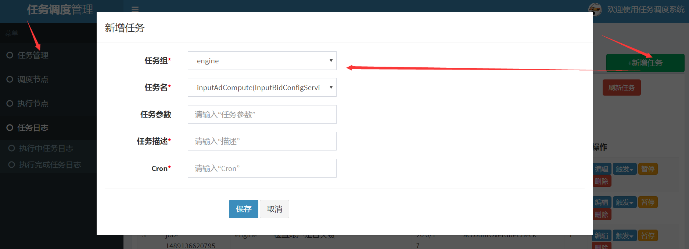

6. 如果想要手动触发任务，则点击任务对应的“触发”按钮（如果任务是刚刚配置的，则需要先点击“刷新任务”按钮，保证任务被刷新到调度器），并选择是在seed机还是线上机执行任务。然后在页面上会实时显示任务的运行情况

   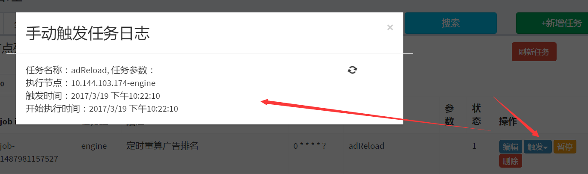

7. 如果要查看任务运行情况，则可以点击“任务日志”按钮，选择查看正在执行的任务日志以及执行完成的任务日志

8. 如果要查看调度器/执行器的情况，则分别点击“调度节点”和“执行节点”查看

9. 如果需要编辑/暂停/删除任务，则在任务管理页面对应任务上，点击相应按钮即可

## 模块介绍

调度系统由四大模块组成，core，scheduler，executor，admin。core为公用包，其他三个模块都依赖core包。scheduler实现调度器功能，以jar包形式单独部署为调度器。executor为执行器实现，以jar包形式发布到自建的maven仓库中，供应用程序引用。admin为管理后台，以jar包形式单独部署为admin后台。项目中还有一个executor-example模块，这个可看做是如何在应用项目中使用executor模块的示例模块。项目结构如下：

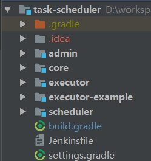

### core

core模块是整个调度系统的核心，封装了网络调用，注册中心，指标监控等通用功能，被admin，scheduler，executor模块引用。core模块结构如下：

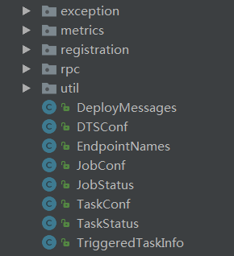

下面分别介绍core中每个包的作用

#### metrics

metrics包通过使用开源项目```Metrics```实现了指标监控功能。metrics有两大接口：Source和Sink。主要实现了定时/实时收集所在机器上的监控数据（如jvm信息，任务执行相关信息），并将收集到的监控信息定时上报给外部监控系统（如InfluxDB）。

Source接口用来收集监控指标（可以通过定时扫描某些数据结构来收集指标，如定时记录队列长度；也可以通过在程序中直接埋点来收集指标），每个需要监控指标的模块可以自行实现一个Source方法，来定制需要收集的指标。当前core包metrics包中实现了一个公用的Source，即JvmSource，用来监控调度系统中所有类型节点（admin，scheduler，executor）的jvm使用情况。

Sink接口用来将Source接口实现类收集到的指标数据暴露给外部监控系统（如JMX）或直接发送到外部监控系统（如InfluxDB）。Sink接口统一在core包中实现，无需子模块单独实现，当前包含两个实现：GraphiteSink和InfluxDBSink，分别实现了将监控数据发送到外部的Graphite和InfluxDB中。

#### registration

registration包通过使用开源项目```Curator```实现了基于ZooKeeper的注册中心，可以用来注册和发现机器节点。调度系统包含两类节点：Master和Worker，分别对应调度节点（Scheduler）和执行节点（Executor）。调度节点和执行节点在启动时，都要首先向注册中心注册节点；当节点停止运行时（如Executor所在机器重启），会向注册中心注销本节点。当节点注册/注销成功时，会向监听对应类型（Master/Worker）的节点发送通知，从而实现节点发现功能。具体的Admin后台，调度器，执行器的节点注册和发现细节会在子模块对应的部分介绍。

#### rpc

rpc包通过使用开源项目```Netty```实现了调度系统的网络调用功能，可以看作是调度系统封装的RPC实现。rpc包主要功能包括Server和Client的创建和销毁，链路维持，自定义一套编码规则实现编解码，消息发送和接收队列等功能。

rpc结构：

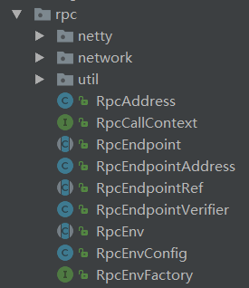

rpc包分为两大子包，其中network包通过封装`Netty`实现了底层的网络通信，拆包/粘包，编解码，超时处理等功能。netty包在network包的基础上实现了rpc调用，建立了应用层的接收/发送缓存，实现了rpc调用的生命周期，为上层代码封装了rpc调用的高级api。上层代码只需继承`RpcEndpoint`接口，并在对应生命周期自定义实现即可。下面分别介绍network和netty两个包的实现:

##### network

network包使用`Netty`，定义了一套消息格式，实现了节点间的相互通信。network包结构如下，其中buffer包实现了NIO buffer和Netty buffer的相互转换。client包实现了客户端，可以发送请求和接收来自服务端的响应。protocol包实现了消息类型和编解码的定义。server包实现了服务端，可以接收来自客户端的请求并进行处理后将处理结果返回给客户端。

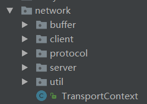

调度系统定义了四种消息类型：`RpcRequest`，`RpcFailure`，`RpcResponse`，`OneWayMessage`。这四种类型消息按照发起端的不同可分为客户端发送给服务端的请求消息（`RpcRequest`，`OneWayMessage`）和服务端返回给客户端的响应消息（`RpcFailure` ，`RpcResponse`）。按照是否需要服务端返回应答，分为Rpc消息（服务端需要对客户端的每个RpcRequest请求返回RpcResponse或RpcFailure）和OneWay消息（服务端不需要应答客户端的OneWayMessage请求）。类图如下：

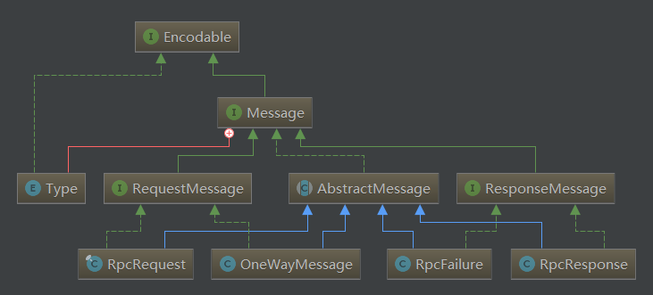

调度系统为这四种消息定义了在网络上传输的网络包结构，客户端和服务端使用相同的包结构对发送和接收的数据进行编解码。对于RpcMessage类型消息（RpcRequest，RpcResponse，RpcFailure），网络包结构如下：

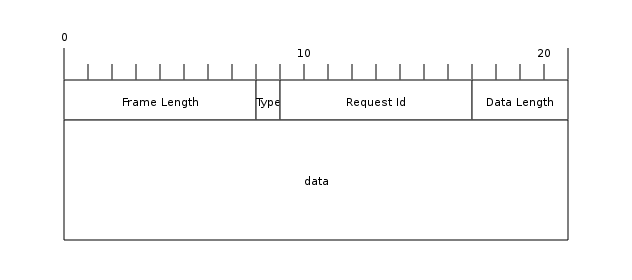

对于OneWayMessage类型消息，消息头中不包含Request Id字段，网络包如下：


包结构说明：

| 字段           | 说明                                       | 所占字节 |
| ------------ | ---------------------------------------- | ---- |
| Frame Length | 整个消息的字节数                                 | 8    |
| Type         | 消息类型（`RpcRequest`/`RpcResponse`/`RpcFailure`/`OneWayMessage`） | 1    |
| Request Id   | 请求的消息Id（如果是RpcMessage消息，则使用RequestId唯一标识一个请求&响应的消息） | 8    |
| Data Length  | 消息体字节数                                   | 4    |
| data         | 消息体（当前使用Java序列化消息对象）                     | -    |

在定义了消息类型和包结构后，调度系统使用如下的结构实现了网络包到应用层对象，应用层对象到网络包的转换过程：

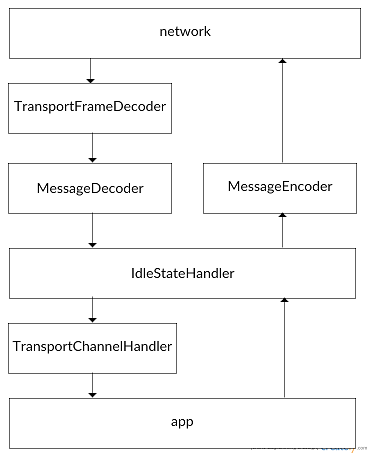

`Netty`为每一个链路建立了接收消息处理器流水线和发送消息处理器流水线，同一流水线中上一个处理器输出的结果作为下一个处理器的输入。

对于接收消息处理器流水线，来自网络的包首先由`TransportFrameDecoder`处理，`TransportFrameDecoder`用来处理粘包/拆包问题，将网络的字节流按照上文定义的网络消息包结构最终组装成一个一个的消息包，供下游的`MessageDecoder`处理器使用。`MessageDecoder`用来根据包中Type字段，将数据包解码成对应的类型的消息，以供`TransportChannelHandler`使用。`TransportChannelHandler`根据不同的消息类型，调用不同的处理模块，并最终将消息发送给`netty`包中的`NettyRpcHandler`。`TransportChannelHandler`运行流程如下：

对于`RequestMessage`类型消息，`TransportChannelHandler`委托给`TransportRequestHandler`执行。`TransportRequestHandler`根据`RequestMessage`类型的不同，将`RpcRequest`委托给`RpcHandler`中带回调函数的receive方法执行（`RpcHandler`为接口，具体实现类为`netty`包中的`NettyRpcHandler`类），当`RpcHandler`成功执行消息后，会调用回调函数中的onSuccess方法，向客户端发送`RpcResponse`消息。如果`RpcHandler`执行消息失败，则会调用回调函数中的onFailure方法，向客户端发送`RpcFailure`消息。对于`OneWayMessage`类型的消息，则会直接调用`RpcHandler`中不带回调函数的receive方法执行。

对于`ResponseMessage`类型消息，`TransportChannelHandler`委托给`TransportResponseHandler`执行。`TransportResponseHandler`首先会根据消息中的requestId找到对应的回调函数（客户端在向服务端发送`RpcRequest`时，会生成一个唯一的requestId，并将回调函数注册到`TransportResponseHandler`中，服务端在向客户端发送响应时，会将请求中的requestId返还给客户端，用于标识是对于客户端哪个请求的响应）。对于`RpcResponse`类型的消息，调用回调函数中的onSuccess方法，执行客户端在收到服务器的成功响应时的钩子方法。对于`RpcFailure`类型的消息，调用回调函数中的onFailure方法，执行客户端在收到服务器的失败响应时的钩子方法。

##### netty

`netty`包是对network包的高级封装，实现了消息收发队列，异常处理等功能，封装了一个`RpcEndpoint`抽象类，定义了网络通信过程的生命周期，上层应用如果要使用网络通信功能，直接继承`RpcEndpoint`类，并在对应的生命周期方法中自定义实现即可。

来自网络的消息，通过`network`包处理后，最终会传递给`netty`包中的`NettyRpcHandler`类，`NettyRpcHandler`使用Java字节码反序列化消息体中字节，生成请求对象后最终将消息发送给`Dispatcher`。`Dispatcher`对于当前节点每个注册的`RpcEndpoint`创建一个收信箱（`Inbox`）。接收到的消息首先被放到统一的接收队列中，然后不断从队列中取出放入每个`RpcEndpoint`对应的收信箱中。在收信箱中，会根据消息的类型，对于`RpcRequest`的消息会最终调用`RpcEndpoint`中的receiveAndReply方法，对于`OneWayMessage`的消息最终会调用`RpcEndpoint`中的receive方法执行。具体执行流程如下：

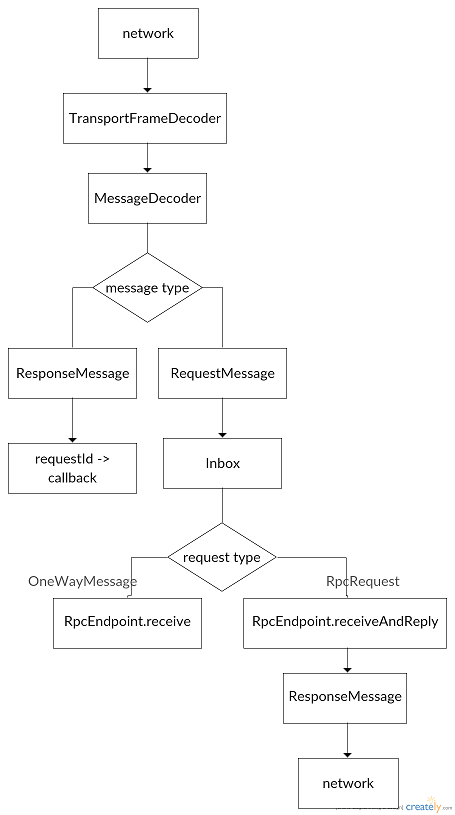

当应用需要向网络发送请求时，如果想发送`RpcRequest`类型的消息，调用`NettyRpcEnv`中的ask方法。如果想发送`OneWayMessage`类型的消息，则调用`NettyRpcEnv`中的send方法（`NettyRpcEnv`为调度系统初始化网络配置，创建网络client/server的类）。`NettyRpcEnv`会为每个网络链路建立一个发信箱（`OutBox`）。发送的消息首先被放入发信箱中，然后根据消息类型的不同，对于`RpcRequest`类型的消息，调用`TransportClient`的sendRpc方法，发送消息并将消息的回调函数按照消息的requestId注册到`TransportResponseHandler`中。对于`OneWayMessage`类型的消息，调用`TransportClient`的send方法直接发送。具体执行流程如下：

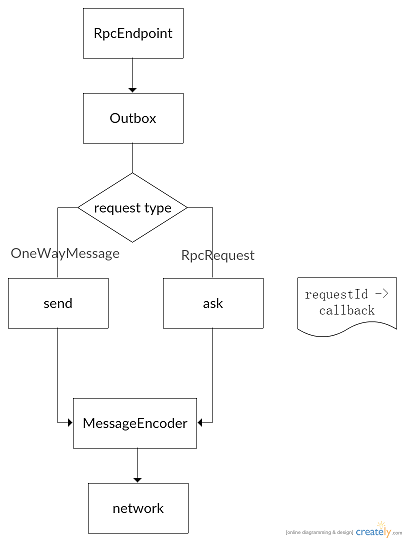

### scheduler

scheduler模块实现了调度器相关功能。**部署时将scheduler模块单独打成jar包并部署到服务器，从而启动一个调度器**。调度器运行的时序图如下：

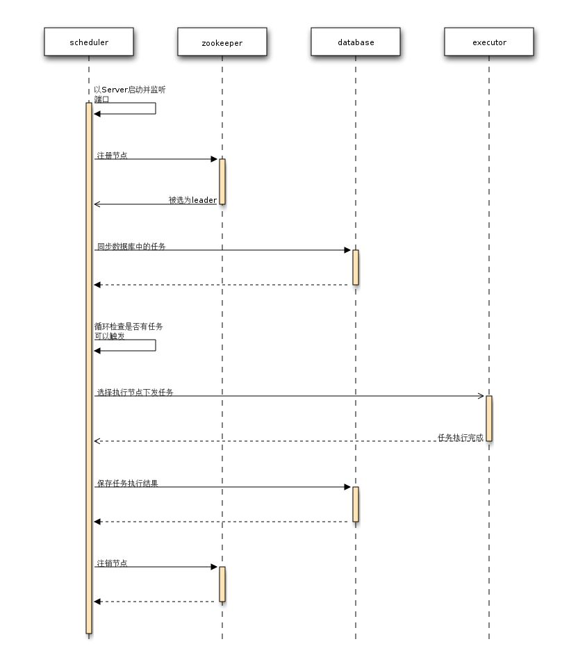

一个任务成功执行的流程大致如下：在调度器启动时，会首先向注册中心注册（详见**节点注册&监听**）。所有任务的下发都由leader调度器下发（详见**leader选举**）。leader调度器首先将数据库中的任务刷新到内存中（详见**任务刷新**），定时将达到触发时间的任务放到可执行队列中（详见**任务触发**），当可执行队列中存在可执行任务时，通过任务选择器选择一个任务执行（详见**任务选择器**），并根据任务所属的worker group，通过执行节点选择器选择一个执行节点（详见**执行节点选择器**），将任务下发到选定的执行节点执行。当任务执行完成后，执行节点将任务执行结果上报给调度器，调度器将任务执行结果保存到数据库中。如果任务执行超时，则重新调度任务执行（详见**超时处理**）。

下面分别对任务执行流程中的各个阶段进行详细说明（为了区分应用程序中编写的任务和每次触发的任务，这里将应用程序编写并在Admin后台配置的任务称为job，对每个时间点触发的任务称为task，即每个task可以看做是job在某个时间点的实例）：

#### 节点注册&监听

调度器在启动时，会首先向注册中心注册本节点，将节点ip和监听端口保存到注册中心。执行器可以从注册中心获取到调取器地址和端口，从而建立通信。

调度器同时会向注册中心注册一个对执行器列表的监听。当执行器列表发生变化时（如应用程序的重启），调度器会从注册中心获取到最新的执行器列表，并刷新本地执行器列表。为了程序健壮性，调度器在启动时也会启动一个守护线程，定时同步注册中心的执行器列表（定时刷新间隔可由参数`dts.master.syncWorkerSec`配置，单位为秒，默认为60秒）。

#### leader选举

调度系统为了防止调度器存在单点风险，可以配置多台调度节点，并选举出一个调度器作为leader节点，其他节点作为standby节点。只有leader节点会下发task，standby节点只是作为leader节点的备份，不实际下发task。当leader节点故障时，调度系统会重新进行选举，选出新的leader节点。故障的leader节点恢复后会成为standby节点。

#### 任务刷新

从Admin录入的job直接保存到数据库中。在调度器被选为leader节点后，会启动一个守护线程定时将数据库中的job刷新到内存中。job刷新频率可由参数`dts.master.cronJob.refreshSec`配置，单位为秒，默认为300秒。

#### 任务触发

在调度器被选为leader节点后，会启动一个守护线程定时检查内存中job是否达到cron表达式配置的触发时间（可通过参数`dts.task.trigger.intervalMs`配置，单位为毫秒，默认为1000毫秒，检查间隔为这个值的一半，即默认500毫秒检查一次是否有job可以触发），当前通过cron和job上次执行时间计算出job下次的执行时间，如果job的下次执行时间在设定的时间范围内（时间范围为[now - `dts.task.trigger.intervalMs`* 10, now + `dts.task.trigger.intervalMs`]，如果job下次执行时间小于下限，则强制将job下次执行时间设为now，即立刻触发一次job），则认为job已经可以执行，这时会生成一个可执行task，保存到内存中的可执行队列中，并持久化到数据库中（保存到数据库dts_cron_tasks表）。

#### 任务选择器

调度器中维护了两个task队列：可执行task队列和执行中task队列，分别保存可执行的task和正在运行（即执行节点还没有上报执行结果）的task。调度器还为每个job维护了一个执行成功task的id（在从job生成task时，后台会为task生成一个递增的id，所以对于一个job的所有task来说，id大的task的触发时间是在id小的task之后的），如果获取到的task的id小于相同job里已成功执行的task的最大id，则说明job下一个时段的task已经执行，当前的task可以直接丢弃掉。

任务选择器还可以配置同一个job同时运行的task数量，如果同一job正在运行的task数量已经达到上限（可以通过参数`dts.task.parallel.run.num`配置，默认为1），则job中下一个task需要等待。任务选择器的执行流程如下：

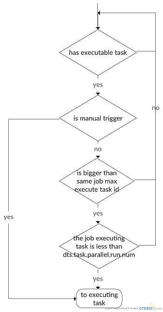

#### 执行节点选择器

根据task中的worker group选择对应的执行节点组，当前只实现了随机从其中选择一个节点作为task下发的执行节点，后续可以增加根据节点负荷状态选择节点下发。如果task没有找到可下发的执行节点，则调度器会重新将task放入可执行队列，进行重试，当重试次数达到上限时（可以通过参数`dts.task.maxRetries`配置最大重试次数，默认为3），则直接丢弃task。

#### 超时处理

在调度器被选为leader后，会启动一个守护线程定时检查已下发的任务是否已经执行超时。当发现已下发的task（即执行中队列中的task）已经超过配置的超时时间和job两次cron的时间间隔的最小值，则认为task已经超时，此时直接将task移出执行中队列，并重新放入可执行队列。检查周期可由参数`dts.task.timeout.checkMs`配置，单位为毫秒，默认为1000毫秒。task超时时间可由参数`dts.task.max.executingSec`配置，单位为秒，默认为-1，即不设置超时时间。

### executor

executor模块实现了执行器的功能，用来接收来自调度器的任务，并利用反射调用应用程序相关方法，来执行任务，已经在任务执行完毕后向调度器上报任务执行结果。**执行器最终以jar包形式发布到maven仓库中，需要使用调度系统的应用项目在项目中引入执行器的依赖即可接入调度系统（当前执行器只支持spring boot形式的应用）**。

执行器的运行的时序图如下：


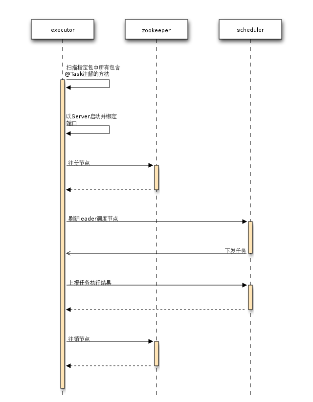

执行器的运行流程为：当执行器所在的应用程序启动时，执行器首先读取应用程序配置的执行器相关的配置文件，然后扫描配置文件中参数`dts.worker.packageName`指定的包（这个包中包含了应用程序中所有需要调度系统调度任务的方法，当前执行器支持以jar包和war包两种部署方式的应用程序的包解析）。然后向注册中心注册应用程序所在节点，并将解析到的应用程序任务信息保存到注册中心（详见**节点注册&监听**）。启动守护线程定时同步leader调度器节点。当执行器接收到来自调度器的task后，解析task并调用应用程序对应的方法执行（详见**任务执行**）。当任务执行完毕后，将执行结果上报给调度器（详见**任务上报**）。

#### 节点注册&监听

在执行器启动时，会首先向注册中心注册当前节点，将节点ip和执行器的监听端口，节点类型（seed还是online节点），以及解析出的应用程序所有的定时任务信息（类名，方法名，方法参数，任务名称等）保存到注册中心。调度器可以从注册中心获取执行器的地址和端口，从而与执行器建立通信。Admin可以从注册中心获取应用的所有定时任务信息，方便在Admin后台直接配置定时任务。

同时执行器向注册中心注册一个对调度器列表的监听，当调度器列表发生变化时，执行器会获取最新的调度器列表，向列表中的每个调度器发送AskLeader请求，从而获取最新的leader调度器，更新本地的leader调度器缓存。为了程序健壮性，执行器也会启动一个守护线程，定时向所有调度器发送AskLeader请求（定时间隔可以由参数`dts.worker.syncMasterSec`配置，单位秒，默认60秒），询问最新的leader调度器，更新本地leader调度器缓存。

#### 任务执行

当执行器收到来自调度器的task时，首先解析task，找到task对应的应用程序方法，解析task中的参数，将参数类型转换为应用程序方法中的实际类型（目前支持除了char的7种基本类型和对应的包装类型，以及String类型），然后将解析后的task保存到待执行task队列中。

执行器启动时，会启动一个守护线程监听待执行task队列是否有task可执行。当待执行task队列中有task时，线程会将task包装为`TaskRunner` 并提交到执行任务线程池中（线程池大小可通过参数`dts.worker.threads`配置，默认为10）。

当线程池分配了一个线程执行task时，会调用`TaskRunner`中的run()方法，在执行task之前和之后记录一些log，最终通过反射调用应用程序中对应的方法实际执行任务。

#### 任务上报

当task执行完毕时，在退出`TaskRunner`的run()方法之前，会将执行结果写入上报task队列。执行器在启动时会开启一个守护线程，当上报队列存在执行完毕的task时，将task执行结果上报给调度器。

### admin

admin模块实现了调度系统的后台管理功能。**admin以spring boot开发，部署时直接打成jar包放到服务器上即可运行**。在admin中对任务的增删改都是直接写数据库的，调度器再定时更新数据库内容到调度器所在缓存。所以admin中增删改都不是实时生效的，如果想要立刻生效，则需要在任务管理页面点击“任务刷新”按钮，手动让调度器刷新任务。admin模块运行时序图如下：

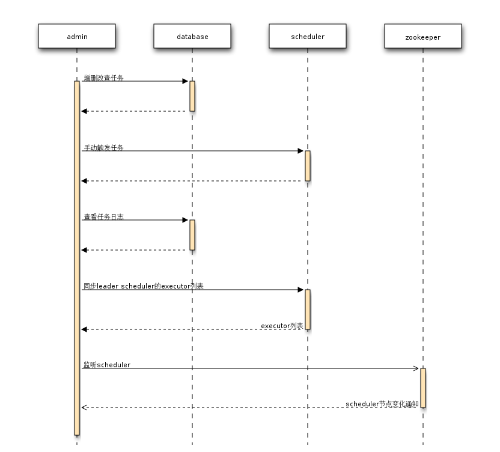

## 数据库设计

当前任务调度系统一共有三张表：dts_cron_jobs，dts_cron_tasks：

```mysql
CREATE TABLE `dts_cron_jobs` (
   `id` int(11) NOT NULL AUTO_INCREMENT,
   `job_id` varchar(32) NOT NULL COMMENT='后台配置的cron任务id',
   `tasks` varchar(256) NOT NULL COMMENT='cron任务配置',
   `cron_expression` varchar(256) NOT NULL COMMENT='cron表达式',
   `worker_group` varchar(32) NOT NULL COMMENT='接入的java应用id',
   `status` tinyint(2) NOT NULL DEFAULT '0' COMMENT='cron任务状态 0删除 1有效',
   `max_run_time_sec` int(11) NOT NULL DEFAULT '-1' COMMENT='cron任务最大执行时间，单位秒',
   `ctime` datetime DEFAULT NULL,
   `utime` timestamp NOT NULL DEFAULT CURRENT_TIMESTAMP ON UPDATE CURRENT_TIMESTAMP,
   `last_trigger_time` timestamp NOT NULL DEFAULT '1978-01-01 00:00:01' COMMENT='cron任务最后触发时间',
   `desc` varchar(256) DEFAULT NULL COMMENT='cron任务描述',
   PRIMARY KEY (`id`),
   UNIQUE KEY `uk_job_id` (`job_id`)
 ) ENGINE=InnoDB DEFAULT CHARSET=utf8 COMMENT='定时任务配置表';

CREATE TABLE `dts_cron_tasks` (
   `id` int(11) NOT NULL AUTO_INCREMENT,
   `job_id` varchar(32) NOT NULL COMMENT='cron任务id',
   `task_id` varchar(32) NOT NULL COMMENT='cron任务中子任务id',
   `task_name` varchar(32) NOT NULL COMMENT='触发任务的名称',
   `worker_group` varchar(32) NOT NULL COMMENT='加入的java应用id',
   `sys_id` varchar(32) NOT NULL COMMENT='触发的任务id',
   `params` varchar(256) DEFAULT NULL COMMENT='任务参数',
   `manual_trigger` tinyint(1) NOT NULL DEFAULT '0' COMMENT='是否是手动触发 0否 1是',
   `worker_id` varchar(32) DEFAULT NULL COMMENT='运行任务的节点id',
   `status` tinyint(2) NOT NULL DEFAULT '0' COMMENT='任务执行状态，0删除 1待执行 2执行中',
   `executable_time` datetime DEFAULT NULL COMMENT='任务变成可执行状态的时间',
   `executing_time` datetime DEFAULT NULL COMMENT='任务下发执行时间',
   `ctime` datetime DEFAULT NULL,
   `utime` timestamp NOT NULL DEFAULT CURRENT_TIMESTAMP ON UPDATE CURRENT_TIMESTAMP,
   `trigger_time` datetime DEFAULT NULL COMMENT='任务触发时间',
   `resumes` int(11) NOT NULL DEFAULT '0' COMMENT='任务重试次数',
   PRIMARY KEY (`id`),
   UNIQUE KEY `uk_sys_id` (`sys_id`)
 ) ENGINE=InnoDB DEFAULT CHARSET=utf8 COMMENT='触发任务表';

CREATE TABLE `dts_finish_tasks` (
   `id` int(11) NOT NULL AUTO_INCREMENT,
   `job_id` varchar(32) NOT NULL,
   `task_id` varchar(32) NOT NULL,
   `task_name` varchar(32) NOT NULL,
   `worker_group` varchar(32) NOT NULL,
   `sys_id` varchar(32) NOT NULL,
   `params` varchar(256) DEFAULT NULL,
   `manual_trigger` tinyint(1) NOT NULL DEFAULT '0',
   `worker_id` varchar(32) DEFAULT NULL,
   `executable_time` datetime DEFAULT NULL,
   `executing_time` datetime DEFAULT NULL,
   `finish_time` datetime DEFAULT NULL,
   `ctime` timestamp NOT NULL DEFAULT CURRENT_TIMESTAMP ON UPDATE CURRENT_TIMESTAMP,
   `execute_result` varchar(1024) DEFAULT NULL,
   `status` tinyint(4) NOT NULL DEFAULT '0' COMMENT='日志状态 1有效 0无效',
   PRIMARY KEY (`id`)
 ) ENGINE=InnoDB DEFAULT CHARSET=utf8 COMMENT='完成任务表';
```

需要说明的是，job_id和task_id以及sys_id。任务调度系统设计上支持在后台配置一组任务，并按照任务顺序在执行完上一个任务后，自动触发下一个任务执行（虽然当前版本只支持一个任务组中只有一个任务）。这里的任务组即为job，对应job_id。而任务组中配置的任务即为task，对应task_id。sys_id是task在每次触发时，系统为当前触发的task生成的id。

## 配置项

### core

rpc相关配置项，可在scheduler，executor，admin的配置文件中配置：

| 参数                            | 默认值    | 说明                                       |
| ----------------------------- | ------ | ---------------------------------------- |
| dts.rpc.mode                  | NIO    | 支持NIO和EPOLL                              |
| dts.rpc.preferDirectBufs      | true   | Netty是否使用堆外内存                            |
| dts.rpc.io.connectionTimeout  | 120000 | 连接超时时间，单位毫秒                              |
| dts.rpc.backLog               | -1     | TCP未完成三次握手的队列大小，-1使用Netty默认值             |
| dts.rpc.numConnectionsPerPeer | 1      | 对于每个地址的client连接池大小                       |
| dts.rpc.serverThreads         | 0      | Netty server eventLoop线程池大小，0使用默认大小（核数*2） |
| dts.rpc.clientThreads         | 0      | Netty client eventLoop线程池大小，0使用默认大小（核数*2） |
| dts.rpc.sendBuffer            | -1     | TCP发送缓冲，-1使用Netty默认设置                    |
| dts.rpc.receiveBuffer         | -1     | TCP接收缓冲，-1使用Netty默认设置                    |

ZooKeeper相关配置项，可在scheduler，executor，admin的配置文件中配置：

| 参数                       | 默认值     | 说明                     |
| ------------------------ | ------- | ---------------------- |
| dts.master.zookeeper.url | 必填，无默认值 | ZooKeeper地址，多个地址以“,”分割 |
| dts.zookeeper.dir        | /dts    | ZooKeeper根目录           |

InfluxDB相关配置项（如果需要查看任务调度系统指标，则需要配置如下项），可在scheduler，executor，admin的配置文件中配置：

| 参数                                 | 默认值  | 说明                |
| ---------------------------------- | ---- | ----------------- |
| dts.metric.sink.influxdb.host      | 必填   | InfluxDB地址        |
| dts.metric.sink.influxdb.port      | 必填   | InfluxDB端口        |
| dts.metric.sink.influxdb.user      | 必填   | InfluxDB用户名       |
| dts.metric.sink.influxdb.password  | 必填   | InfluxDB密码        |
| dts.metric.sink.influxdb.database  | 必填   | InfluxDB数据库       |
| dts.metric.sink.influxdb.periodSec | 10   | 上报到InfluxDB周期，单位秒 |

其他配置项，可在scheduler，executor，admin的配置文件中配置：

| 参数                                  | 默认值        | 说明                          |
| ----------------------------------- | ---------- | --------------------------- |
| dts.port.maxRetries                 | 16         | 如果指定的监听端口被占用，则尝试绑定其他端口的最大次数 |
| dts.rpc.connect.threads             | 64         | 创建client的线程池大小              |
| dts.rpc.netty.dispatcher.numThreads | Max(2, 核数) | 处理接收消息队列中消息的线程池大小           |

### scheduler

| 参数                            | 默认值  | 说明                       |
| ----------------------------- | ---- | ------------------------ |
| dts.master.syncWorkerSec      | 60   | 同步执行器周期，单位秒              |
| dts.worker.timoutMs           | 1000 | 执行器响应超时时间，单位毫秒           |
| dts.task.maxRetries           | 3    | task最大重试次数               |
| dts.task.parallel.run.num     | 1    | job最大同时运行的task数目         |
| dts.task.trigger.intervalMs   | 1000 | 检查job是否可以触发的周期，单位毫秒      |
| dts.task.timeout.checkMs      | 1000 | 检查task是否超时的周期，单位毫秒       |
| dts.task.max.executingSec     | -1   | task超时时间，单位秒，-1表示不设置超时时间 |
| dts.master.cronJob.refreshSec | 300  | 刷新job周期，单位秒              |
| dts.master.port               | 0    | 调度器监听端口，0表示随机绑定一个端口      |

### executor

| 参数                       | 默认值     | 说明                  |
| ------------------------ | ------- | ------------------- |
| dts.worker.groupId       | 必填，无默认值 | 应用组ID               |
| dts.worker.packageName   | 必填，无默认值 | 应用程序task方法所在包       |
| dts.worker.threads       | 10      | task线程池大小           |
| dts.worker.syncMasterSec | 60      | 同步调度器周期，单位秒         |
| dts.master.timeoutMs     | 1000    | 调度器响应超时时间，单位毫秒      |
| dts.worker.port          | 0       | 执行器监听端口，0表示随机绑定一个端口 |